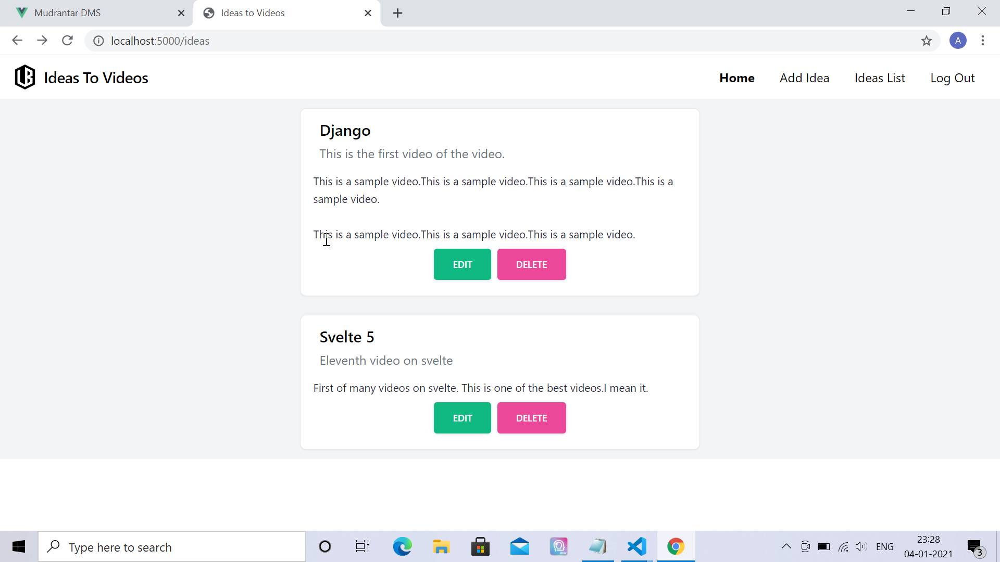
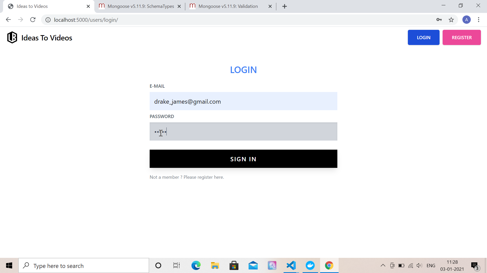
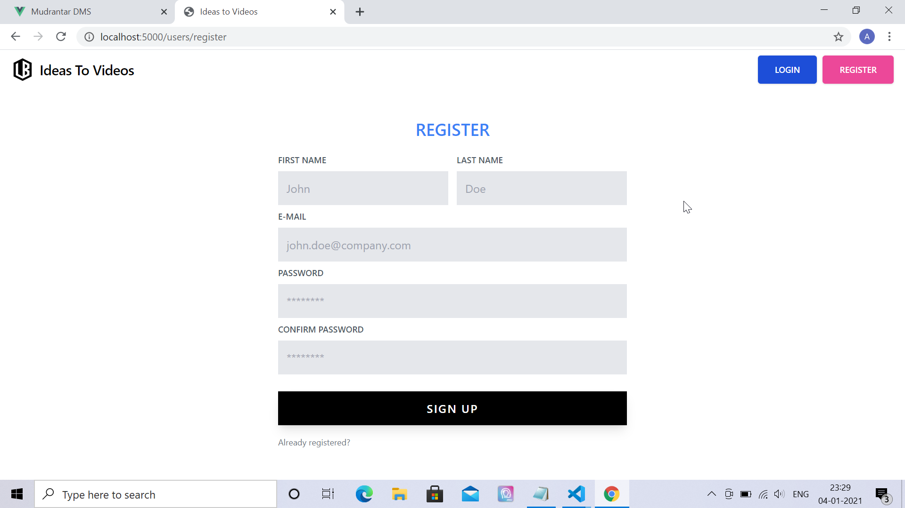
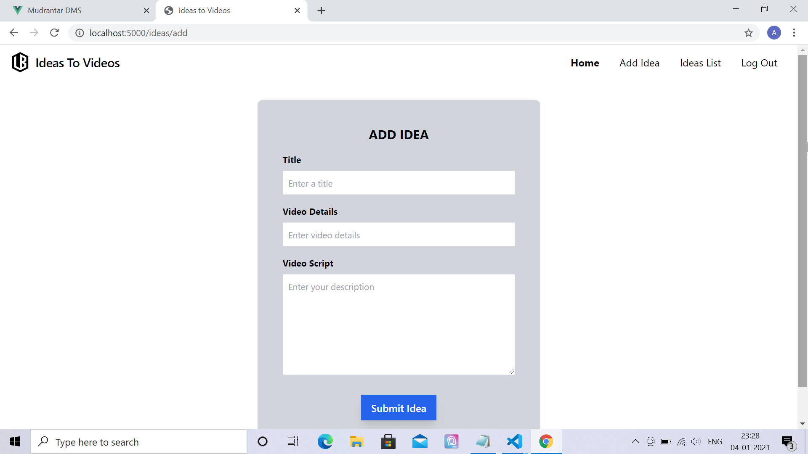

# Ideas to videos

## Project Briefing

This is a multi-user application which would keep track of the ideas on which you plan to make videos in the future. For each idea, you can add details, title and script for the video.

Tailwind component design is inspired from the website 
https://tailwindcomponents.com/

## Built With

* [Express JS](https://expressjs.com)
* [MongoDB](https://www.mongodb.com/)
* [Tailwind CSS](https://tailwindcss.com/)

## Authors

* **Amit Prafulla (APFirebolt)** - (https://apgiiit.com/)

## Project setup
Since this project uses Mongodb as noSQL database. MongoDB needs to be configured on your system. After configuring mongoDB, install npm packages. For templating engine, it uses express handlebars.
```
npm install
npm run start
```

## Project Screenshots

Please find some of the screenshots of the application. First screenshot depicts the page from where you can add ideas in this app.



This shows login page.



This shows register page.



This shows page form which would be used to populate the app with ideas.

